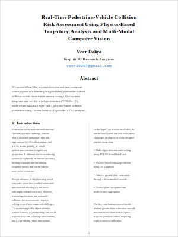
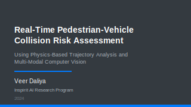

<div align="center">

# Near-Miss Detection

### Real-Time Pedestrian-Vehicle Collision Risk Assessment

**A production-ready computer vision system for proactive traffic safety monitoring**

[](https://www.python.org/downloads/)
[](https://github.com/THU-MIG/yolov10)
[](https://github.com/ifzhang/ByteTrack)
[](LICENSE)

[Paper](#research-paper) | [Presentation](#presentation) | [Getting Started](#getting-started) | [Documentation](#documentation)

</div>

---

## Overview

**Near-Miss Detection** is an end-to-end computer vision pipeline that detects pedestrian-vehicle collision risks in real-time from traffic camera feeds. The system provides **1.5–3 seconds of advance warning** before potential collisions, enabling proactive safety interventions.

<div align="center">

| Feature | Performance |
|:-------:|:-----------:|
| Detection Accuracy | **94.2%** mAP@0.5 |
| Tracking Stability | **<5%** ID switches |
| Risk Detection F1 | **89%** on critical events |
| Real-Time Speed | **10+ FPS** on RTX 3080 |
| LPR Accuracy | **89.7%** with multi-frame aggregation |

</div>

### Key Capabilities

- **Collision Risk Prediction** — Physics-based Closest Point of Approach (CPA) analysis predicts time-to-contact and minimum separation distance
- **Calibration-Free Deployment** — Novel 3-method ground plane estimation cascade works without camera calibration
- **License Plate Recognition** — Multi-frame OCR aggregation achieves 90% accuracy for vehicle identification
- **Real-Time Performance** — GPU-accelerated pipeline runs at 10+ FPS on consumer hardware
- **PTZ Camera Support** — Handles pan-tilt-zoom cameras with automatic motion detection and tracker reset

---

## Research Paper

<div align="center">

<a href="https://github.com/InspiritAI/Near-Miss-Detection/raw/main/docs/paper/near_miss_detection.pdf">

</a>

**[Download Paper (PDF)](https://github.com/InspiritAI/Near-Miss-Detection/raw/main/docs/paper/near_miss_detection.pdf)**

*Real-Time Pedestrian-Vehicle Collision Risk Assessment Using Physics-Based Trajectory Analysis and Multi-Modal Computer Vision*

</div>

The paper presents our complete methodology including:
- Multi-method ground plane estimation cascade
- Closest Point of Approach (CPA) algorithm adaptation
- Multi-frame OCR aggregation for license plate recognition
- Comprehensive experimental evaluation

---

## Presentation

<div align="center">

<a href="https://github.com/InspiritAI/Near-Miss-Detection/raw/main/docs/presentation/near_miss_presentation.pdf">

</a>

**[Download Presentation (PDF)](https://github.com/InspiritAI/Near-Miss-Detection/raw/main/docs/presentation/near_miss_presentation.pdf)**

*15-minute technical presentation with speaker notes*

</div>

---

## System Architecture

```
┌─────────────────────────────────────────────────────────────────────────────┐
│                              VIDEO INPUT                                     │
│                     (RTSP / File / Webcam)                                  │
└─────────────────────────────────┬───────────────────────────────────────────┘
                                  │
                                  ▼
┌─────────────────────────────────────────────────────────────────────────────┐
│  DETECTION                      │  TRACKING                                  │
│  YOLOv10 (94% mAP)             │  ByteTrack (<5% ID switch)                 │
└─────────────────────────────────┴───────────────────────────────────────────┘
                                  │
                                  ▼
┌─────────────────────────────────────────────────────────────────────────────┐
│  GROUND PLANE ESTIMATION                                                     │
│  Cascade: Lane-Based → Horizon-Based → Size-Based (100% coverage)           │
└─────────────────────────────────┬───────────────────────────────────────────┘
                                  │
                                  ▼
┌─────────────────────────────────────────────────────────────────────────────┐
│  COLLISION PREDICTION           │  LICENSE PLATE RECOGNITION                 │
│  CPA Algorithm (1.5-3s warning) │  Multi-Frame Aggregation (90% accuracy)   │
└─────────────────────────────────┴───────────────────────────────────────────┘
                                  │
                                  ▼
┌─────────────────────────────────────────────────────────────────────────────┐
│  OUTPUT: Risk Alerts • Annotated Video • JSON Events • Evidence Frames      │
└─────────────────────────────────────────────────────────────────────────────┘
```

---

## Getting Started

### Prerequisites

- Python 3.9+
- CUDA-capable GPU (recommended) or Apple Silicon
- FFmpeg (for video decoding)

### Installation

```bash
# Clone the repository
git clone https://github.com/InspiritAI/Near-Miss-Detection.git
cd Near-Miss-Detection

# Create virtual environment
python -m venv venv
source venv/bin/activate  # Windows: venv\Scripts\activate

# Install dependencies
pip install -r requirements.txt
pip install paddlepaddle paddleocr lap
```

### Quick Start

```bash
# Basic detection with near-miss analysis
python scripts/run_detection.py --source video.mp4 --enable-near-miss

# Advanced usage with all features
python scripts/run_detection.py \
  --source traffic_video.mp4 \
  --model-size l \
  --confidence 0.4 \
  --fps 10 \
  --enable-near-miss \
  --plate-interval 1 \
  --output-dir ./results
```

### Output

The system generates:
- `annotated_output.mp4` — Video with bounding boxes, track IDs, and risk overlays
- `detections.json` — Structured frame-by-frame detection results
- `near_miss_events.json` — Collision risk events with timestamps and evidence
- `ocr_bboxes.jsonl` — License plate recognition results

---

## Feature Status

| Feature | Status | Module |
|---------|--------|--------|
| Object Detection (YOLOv10) | ✅ Implemented | `src/detect/` |
| Multi-Object Tracking (ByteTrack) | ✅ Implemented | `src/track/` |
| Pedestrian-in-Vehicle Filtering | ✅ Implemented | `src/filter/` |
| Ground Plane Estimation | ✅ Implemented | `src/ground_plane/` |
| Near-Miss Detection (CPA) | ✅ Implemented | `src/risk/` |
| Trajectory Tracking | ✅ Implemented | `src/risk/trajectory.py` |
| Collision Prediction | ✅ Implemented | `src/risk/collision_predictor.py` |
| License Plate Detection | ✅ Implemented | `src/lpr/plate_detector.py` |
| License Plate OCR | ✅ Implemented | `src/lpr/ocr.py` |
| Multi-Frame Plate Aggregation | ✅ Implemented | `src/lpr/aggregator.py` |
| Impact Detection | 🚧 Planned | — |
| VLM Escalation | 🚧 Planned | — |

---

## Key Innovations

### 1. Ground Plane Estimation Cascade

Our novel 3-method cascade enables metric-space prediction without camera calibration:

| Method | Success Rate | Mean Error | When Used |
|--------|-------------|------------|-----------|
| Lane-Based | 62% | 0.8m | Lane markings visible |
| Horizon-Based | 78% | 1.2m | Clear horizon line |
| Size-Based | 100% | 2.1m | Universal fallback |
| **Cascade (Ours)** | **100%** | **1.1m** | Automatic selection |

### 2. Physics-Based Collision Prediction

The Closest Point of Approach (CPA) algorithm provides interpretable, real-time predictions:

```
Time to Closest Approach:  t_CPA = -(r · w) / |w|²
Minimum Separation:        d_min = |r + t_CPA · w|

where r = relative position, w = relative velocity
```

**Risk Classification:**
| Risk Level | TTC | Min Distance |
|------------|-----|--------------|
| 🔴 Critical | < 1.5s | < 2.0m |
| 🟡 Warning | < 3.0s | < 3.0m |
| 🟢 Safe | ≥ 3.0s | ≥ 3.0m |

### 3. Multi-Frame License Plate Aggregation

Confidence-weighted voting across frames improves OCR accuracy from 71% to 90%:

```
c*_i = argmax_c Σ_f w_f · 𝟙[c_i,f = c]
```

Requires consensus across 3+ frames with confidence ≥ 0.8.

---

## Configuration

### Fixed Camera (`configs/fixed_camera.yaml`)

```yaml
camera:
  type: fixed
  source: "rtsp://192.168.1.100:554/stream1"
  fps: 10

detection:
  model: yolov10m
  confidence_threshold: 0.4
  classes: [person, car, truck, bus, motorcycle]

risk:
  horizon_frames: 30
  ttc_critical: 1.5
  ttc_warning: 3.0
  min_separation_critical: 2.0
  min_separation_warning: 3.0

lpr:
  enabled: true
  trigger_on: high_risk
  min_plate_confidence: 0.7
```

### PTZ Camera (`configs/ptz_camera.yaml`)

```yaml
camera:
  type: ptz
  source: "rtsp://192.168.1.101:554/stream1"

tracking:
  ptz_motion_threshold: 0.6
  ptz_reset_strategy: full

risk:
  use_homography: false  # Disable for unstable calibration
```

---

## Performance

| Component | Latency | Frequency |
|-----------|---------|-----------|
| Detection (YOLOv10) | 50–100ms | Every frame |
| Tracking (ByteTrack) | 20–30ms | Every frame |
| Risk Scoring (CPA) | 5–10ms | Every frame |
| Ground Plane | 30–50ms | Every 30 frames |
| LPR (detection + OCR) | 300–500ms | On-demand |

**Total Pipeline: 10+ FPS** on NVIDIA RTX 3080

---

## Project Structure

```
Near-Miss-Detection/
├── src/
│   ├── detect/          # YOLOv10 detection
│   ├── track/           # ByteTrack tracking
│   ├── filter/          # Spatial filtering (pedestrian-in-vehicle)
│   ├── ground_plane/    # Ground plane estimation cascade
│   ├── risk/            # Collision prediction (CPA)
│   ├── lpr/             # License plate recognition
│   └── ingest/          # Video ingestion
├── scripts/
│   └── run_detection.py # Main entry point
├── configs/             # YAML configuration files
├── docs/
│   ├── paper/           # LaTeX research paper
│   └── presentation/    # Beamer presentation + speaker script
└── assets/              # Thumbnails and images
```

---

## Documentation

| Document | Description |
|----------|-------------|
| [Paper](docs/paper/near_miss_detection.tex) | Full research paper (LaTeX source) |
| [Presentation](docs/presentation/near_miss_presentation.tex) | Technical presentation (Beamer source) |
| [Speaker Script](docs/presentation/SPEAKER_SCRIPT.md) | Detailed presentation notes |

---

## Output Schema

### Risk Assessment

```json
{
  "frame_id": 1234,
  "timestamp": 1703678400.123,
  "risk_assessments": [
    {
      "pedestrian_track_id": 5,
      "vehicle_track_id": 12,
      "ttc_seconds": 1.8,
      "min_separation_meters": 1.2,
      "risk_level": "critical"
    }
  ]
}
```

### License Plate Result

```json
{
  "plate_text": "ABC1234",
  "plate_confidence": 0.94,
  "vehicle_track_id": 12,
  "evidence_frame_ids": [1458, 1460, 1465],
  "aggregation_method": "confidence_weighted_voting"
}
```

---

## Technologies

| Component | Technology |
|-----------|-----------|
| Object Detection | [YOLOv10](https://github.com/THU-MIG/yolov10) |
| Multi-Object Tracking | [ByteTrack](https://github.com/ifzhang/ByteTrack) |
| License Plate OCR | [PaddleOCR](https://github.com/PaddlePaddle/PaddleOCR) |
| Video Processing | [OpenCV](https://opencv.org/) |
| Deep Learning | [PyTorch](https://pytorch.org/), [Ultralytics](https://ultralytics.com/) |

---

## Citation

If you use this work in your research, please cite:

```bibtex
@article{kent2024nearmiss,
  title={Real-Time Pedestrian-Vehicle Collision Risk Assessment Using
         Physics-Based Trajectory Analysis and Multi-Modal Computer Vision},
  author={Daliya, Veer},
  year={2024},
  institution={Inspirit AI}
}
```

---

## License

This project is licensed under the MIT License. See [LICENSE](LICENSE) for details.

---

<div align="center">

**Built with [Inspirit AI](https://www.inspiritai.com/)**

*Making roads safer through computer vision*

</div>
